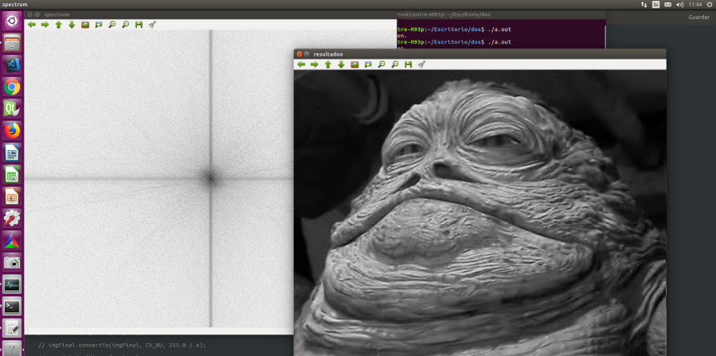

# Topicos en Computacion Grafica 
# Deconvolcion utilizando DFT en CUDA

# Alumno: 
    Carpio Rodiguez David

# Descripcion
    Deconvolución: dada una imagen, A, a la cual se le ha aplicado una convolución, aplicarle otra convolución (convolución inversa) para obtener la imagen original.

    B = M x A  => DFT(B)= DFT(M x A) => DFT(B) = DFT(M)·DFT(A)
    Luego: F = H·G => G = F/H
    Siendo “/” la división, píxel a píxel.

        IDFT(DFT(B)/DFT(M))

# Experimentos y Resultados

    nvcc grafica_deconv.cu `pkg-config --cflags --libs opencv`
    ./a.out borrosa_r.png
## Imagen de entrada borrosa

## Imagen de salida
    Se muestra el espectro y la imagen con deconvolucion, solo se hizo con la imagen en escala de grises.
